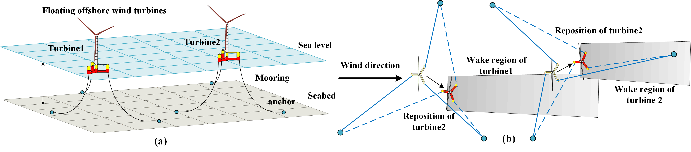

# FloatingFarmYaw
This is the code repository corresponding to our manuscript. 

“Floating Offshore Wind Farm Yaw Control via Model-based Deep Reinforcement Learning”, submitted to IEEE Power & Energy Society General Meeting. [Mingyang Mei](https://scholar.google.com/citations?user=jpXmO2UAAAAJ&hl=zh-CN), Peng Kou, Yilin Xu, [Zhihao Zhang](https://scholar.google.com/citations?hl=zh-CN&user=Qfr4gA4AAAAJ), Runze Tian, Deliang Liang. (Corresponding author: [Peng Kou](https://gr.xjtu.edu.cn/en/web/koupeng))

## Brief Summary
 Our manuscript proposes a model-based deep reinforcement learning (DRL) framework to maximize the total power output of a floating offshore wind farm subject to wake effect. Recognizing the extensive interactions required for DRL training and the partially observable nature of wind farm dynamics, we first develop a physics-based, simplified model that captures the aerodynamic interactions among floating wind turbines. The high computational efficiency of this model enables it to support DRL training and deployment.
 Subsequently, using this model, a model-based DRL scheme is established. The key feature of the scheme is to use the simplified model to assist the training and deployment of the DRL agent, thereby reducing reliance on field measurements. Finally, simulation results on a dynamic wind farm simulator FAST.Farm show that, the proposed scheme can achieve 8.74\% more energy generation in a 20×15 MW floating wind farm compared with conventional yaw control method.
 

      

      Fig.1 The illustration of floating offshore wind turbine repositioning (a) A two-turbine array configuration (b) Top view of the turbine repositioning with yaw control

      

      Fig.2 Simulation results (a) Simplified model (b) Fast.Farm model under the under the model based DRL 
      and (c) Simplified model (d) Fast.Farm model under the under conventional yaw control.

## Requirements
This repository is dependent on [Floris v4.1](https://github.com/NREL/floris), [MoorPy v1.0](https://github.com/NREL/MoorPy), [Pytorch v2.4](https://pytorch.org/) and field measurements from [Pywake](https://github.com/DTUWindEnergy/PyWake). If someone wants to deploy the trained agent, [onnx](https://onnx.ai/) will alse be required for converting the neural networks.

## Quick Use
run [mooring_matrix.py](./Training/mooring_matrix.py) to see the mooring configurations.

run [floris_environment.py](./Training/floris_environment.py) to see the iteration process of the model.

run [main.py](./Training/main.py) to train a DRL agent for floating wind farm yaw control. 

## Future development
This code repository is currently not a final release. Documentations, as well as the codes for validation on Fast.Farm, will be released if our manuscript is accepted.

